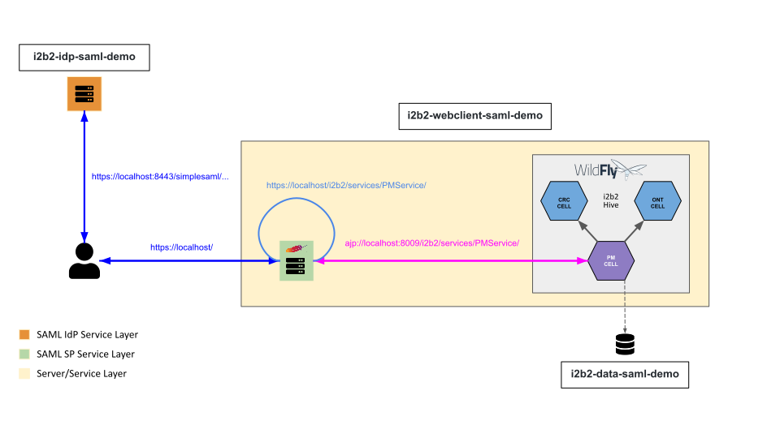

# i2b2-saml-demo

### i2b2 Architecture


### i2b2 Authetication Flow


## Run the i2b2 SAML Demo

Below are commands to run the prebuilt Docker images of the i2b2 demo.

### Prerequisites

- [Docker 19.x or above](https://docs.docker.com/get-docker/)

### Create Docker User-defined Bridge Network

Containers on a user-defined bridge network can communicate with each other by their names.  The i2b2-core-server container needs to communicate with the i2b2-data container.  The i2b2-webclient container needs to communicate with the i2b2-core-server container.

Open up a terminal and execute the following command to create a user-defined bridge network **i2b2-saml-demo-net**.

```
docker network create i2b2-saml-demo-net
```

Execute the following command to verify that network **i2b2-saml-demo-net** is created:

```
docker network ls
```

You should see **i2b2-saml-demo-net** from the output similar to this:

```
NETWORK ID     NAME                 DRIVER    SCOPE
0576db9e5151   bridge               bridge    local
58593240ad9d   host                 host      local
52abc9676b47   i2b2-saml-demo-net   bridge    local
aa3bc8690d35   none                 null      local
```

### Run i2b2 Prebuild Docker Images in Containers

Execute the commands below to run prebuild Docker images in contains on the i2b2-saml-demo-net network.

**Run i2b2-idp-saml-demo container:**

###### Linux / macOS:

```
docker run -d --name=i2b2-idp-saml-demo \
--network i2b2-saml-demo-net \
-p 8080:8080 \
-p 8443:8443 \
-e SIMPLESAMLPHP_ADMIN_PASSWORD=demouser \
kvb2univpitt/i2b2-idp-saml-demo:v1.2021.7
```

###### Windows

```
docker run -d --name=i2b2-idp-saml-demo ^
--network i2b2-saml-demo-net ^
-p 8080:8080 ^
-p 8443:8443 ^
-e SIMPLESAMLPHP_ADMIN_PASSWORD=demouser ^
kvb2univpitt/i2b2-idp-saml-demo:v1.2021.7
```

**Run i2b2-data-saml-demo container:**

###### Linux / macOS:

```
docker run -d --name=i2b2-data-saml-demo \
--network i2b2-saml-demo-net \
-e POSTGRESQL_ADMIN_PASSWORD=demouser \
-p 5432:5432 \
kvb2univpitt/i2b2-data-saml-demo:v1.2021.7
```

###### Windows

```
docker run -d --name=i2b2-data-saml-demo ^
--network i2b2-saml-demo-net ^
-e POSTGRESQL_ADMIN_PASSWORD=demouser ^
-p 5432:5432 ^
kvb2univpitt/i2b2-data-saml-demo:v1.2021.7
```

**Run i2b2-core-server-saml-demo container:**

###### Linux / macOS:

```
docker run -d --name=i2b2-core-server-saml-demo \
--network i2b2-saml-demo-net \
-p 9090:9090 \
kvb2univpitt/i2b2-core-server-saml-demo:v1.2021.7
```

###### Windows

```
docker run -d --name=i2b2-core-server-saml-demo ^
--network i2b2-saml-demo-net ^
-p 9090:9090 ^
kvb2univpitt/i2b2-core-server-saml-demo:v1.2021.7
```

**Run i2b2-webclient-saml-demo container:**

###### Linux / macOS:

```
docker run -d --name=i2b2-webclient-saml-demo \
--network i2b2-saml-demo-net \
-p 80:80 -p 443:443 \
kvb2univpitt/i2b2-webclient-saml-demo:v1.2021.7
```

###### Windows

```
docker run -d --name=i2b2-webclient-saml-demo ^
--network i2b2-saml-demo-net ^
-p 80:80 -p 443:443 ^
kvb2univpitt/i2b2-webclient-saml-demo:v1.2021.7
```
