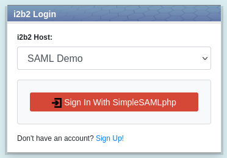
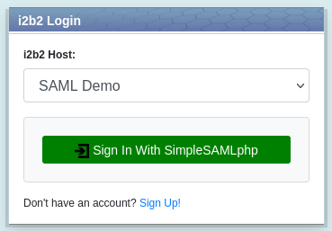
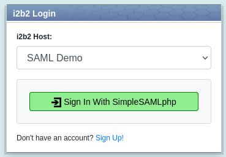
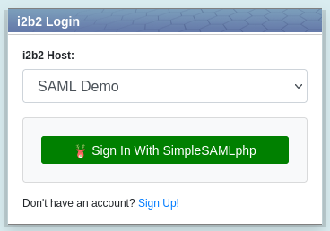
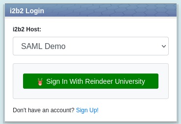

# i2b2 SAML: Customized Identity Provider (IdP) Login Button

A guide on how to customized login button icon and text.


By default the IdP login button looks like the one shown below:



## Changing the Color of the IdP Login Button

Modify the file ***index.php*** file located in the webclient directory.  Change the attribute values of the CSS classs ***btn-idp*** and ***btn-idp:hover***.

### CSS Class: btn-idp

The cololr of the login button.

##### Attribute Value Descriptions and Examples

| Attribute        | Description         | Example Value | Example Value Description |
|------------------|---------------------|---------------|---------------------------|
| color            | button text color   | #fff          | white                     |
| background-color | button color        | #008000       | green                     |
| border-color     | button border color | #008000       | green                     |

##### Example Result



### CSS Class: btn-idp:hover

The cololr of the login button when mouseover.

##### Attribute Value Descriptions and Examples

| Attribute        | Description         | Example Value | Example Value Description |
|------------------|---------------------|---------------|---------------------------|
| color            | button text color   | #000          | black                     |
| background-color | button color        | #90EE90       | light green               |
| border-color     | button border color | #008000       | green                     |

##### Example Result



## Changing the Logo of the IdP Login Button

The icon should be 16x16 pixel.  For an example, below is 16x16 pixel icon file ***reindeer-deer-icon.png***:


Add the icon to the directory **assets/images** of the webclient.

Modify the file ***i2b2_ui_config.js*** located in the directory **js-i2b2** of the webclient.  Change the value of the attribute  ***loginIdpIcon*** to the *relative location* of the icon file.

##### Example Configuration

```js
i2b2.UI.cfg = {
    ...

    loginIdpIcon: "assets/images/reindeer-deer-icon.png", /* Location of the 16x16 icon */

    ...
}
```

##### Example Result



## Changing the IdP Name of IdP Login Button 

Modify the file ***i2b2_ui_config.js*** located in the directory **js-i2b2** of the webclient.  Change the value of the attribute  ***loginIdp*** to the name of your IdP.

##### Example Configuration

```js
i2b2.UI.cfg = {
    ...

    loginIdp: "Reindeer University", /* Text for federated login button */

    ...
}
```

##### Example Result


