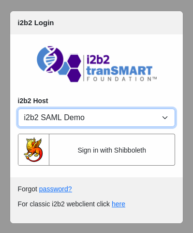
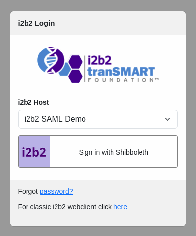
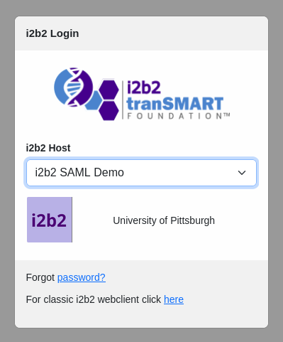

# i2b2 SAML: Customize Identity Provider (IdP) Login Button

A guide on how to customize the IdP login button.

By default the IdP login button looks like the one shown below:



## Customizing the IdP Login Button

Assume the location of the i2b2 webclient on the server is ```/var/www/html/webclient```.

### Changing the Logo of IdP Login Button

Let's say we want to change the default IdP icon to the following icon file **i2b2.png** :


1. Add the icon file **i2b2.png** to the directory ```/var/www/html/webclient/assets/images/sso``` of the webclient.

2. Modify the file **login.html** located in the directory ```/var/www/html/webclient/js-i2b2/cells/PM/assets``` of the webclient.

    Locate the IdP section of the HTML code and change the ***src** attribute of the ***img*** tag to the location of the icon from `````` to ``````.  For an example:

    ```html
    <a class="btn sso-button btn-sm" data-service="shibboleth" style="display: none" tabindex="0">
        
        <div>Sign in with Shibboleth</div>
    </a>
    ```

3. Refresh the webclient and you should see the new Idp icon:

    

### Changing the Text of IdP Login Button

1. Modify the file **login.html** located in the directory ```/var/www/html/webclient/js-i2b2/cells/PM/assets``` of the webclient.

    Locate the IdP section of the HTML code and change the text of ***div** tag.  For an example, change the default text from ***"Sign in with Shibboleth"*** to ***"University of Pittsburgh"***:

    ```html
    <a class="btn sso-button btn-sm" data-service="shibboleth" style="display: none" tabindex="0">
        
        <div>University of Pittsburgh</div>
    </a>
    ```

2. Refresh the webclient and you should see the new text:

    
    