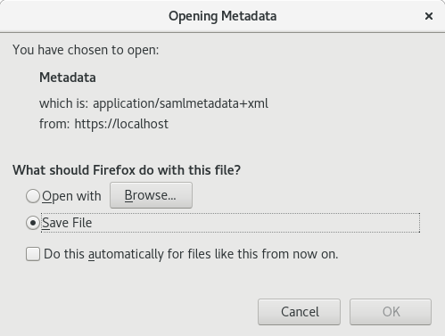

# SAML Setup  For i2b2 (1.7.12a Release) on CentOS 7

A guide for setting up federated authentication using SAML for i2b2 on CentOS 7

> This guide uses ***sp.example.org*** as the domain name.  Please replace ***sp.example.org*** with your domain name.

**Prerequisites**

The following applications and services must be already setup and running:

- i2b2 core server 1.7.12a release
- i2b2 web client release 1.7.12a
- i2b2 database

**Requirements**
- Administrative privileges.

## Preparing for Software Installation

### Updating the Operating System.

It is generally best practice to update the operating system to get the latest security patches and software updates before installing any new software.

Execute the following command to update the operating system:

```
sudo dnf -y update
```

Restart the server for the changes to apply.

### Installing EPEL (Extra Packages for Enterprise Linux)

Please visit [Extra Packages for Enterprise Linux](https://docs.fedoraproject.org/en-US/epel/) for more information.

Execute the following command to install additional open source packages:

```
sudo dnf -y install epel-release
```

Run update again to pull the packages:

```
sudo dnf -y update
```

## Installing Shibboleth

### Installing Shibboleth Service Provider (SP)

Add Shibboleth repository:

```
sudo wget http://download.opensuse.org/repositories/security://shibboleth/CentOS_7/security:shibboleth.repo \
-P /etc/yum.repos.d
```

Update the repository:

```
sudo yum -y update
```

Install Shibboleth:

```
sudo yum -y install shibboleth
```

Enable Shibboleth and restart Apache HTTP server:

```
sudo systemctl enable shibd
sudo systemctl start shibd
sudo systemctl restart httpd
```
### Verifying Installation

Verify that Shibboleth has been properly installed.

#### Confirm Shibboleth functionality:

```
sudo shibd -t
```

You should see output response that ends with  `overall configuration is loadable, check console or log for non-fatal problems
`

#### Confirm Apache functionality:

```
sudo apachectl configtest
```

You should see the output `Syntax OK`.

#### Confirm shibd functionality:

Open up a web browser and navigate to ***https://sp.example.org/Shibboleth.sso/Session***.

> Note: replace *sp.example.org* with your domain name.

You should see the message **A valid session was not found.** in your browser.

## Configuring Shibboleth

### Configuring the Apache HTTP Server

Modify the ***shib.conf*** located in the directory **/etc/httpd/conf.d**.

Delete the following configuration:

```
<Location /secure>
  AuthType shibboleth
  ShibRequestSetting requireSession 1
  require shib-session
</Location>
```

Add the following configuration:

```
<Location />
  AuthType shibboleth
  ShibRequestSetting requireSession 0
  require shibboleth
</Location>
```

### Setting Up Federation Files and Metadata

Your institution should provide you the IdP metadata to register your application or service with their Identity Provider (IdP).  For an example, the Harvard University Information Technology (HUIT) provides a guide and files to reigister with their IdP: https://iam.harvard.edu/resources/saml-shibboleth-integration.

#### Updating the Shibboleth2 XML File

Modify the ***/etc/shibboleth/shibboleth2.xml*** file.

##### Update the SP Entity ID:

Modify the attributes of the **ApplicationDefaults** element as follow:

```xml
<!-- The ApplicationDefaults element is where most of Shibboleth's SAML bits are defined. -->
<ApplicationDefaults entityID="https://sp.example.org/shibboleth"
                        REMOTE_USER="eduPersonPrincipalName,eppn"
                        cipherSuites="DEFAULT:!EXP:!LOW:!aNULL:!eNULL:!DES:!IDEA:!SEED:!RC4:!3DES:!kRSA:!SSLv2:!SSLv3:!TLSv1:!TLSv1.1"
                        signing="true"
                        attributePrefix="AJP_">
```

> Remember to replace *sp.example.org* with your domain name.

##### Set the IdP Entity ID:

Modify the ```<SSO>``` tag as follow:

```xml
<SSO entityID="https://example.org/saml2/idp/metadata.php">
    SAML2
</SSO>
```
> Remember to replace *https://example.org/saml2/idp/metadata.php* with your IdP entity.

##### Modify the ```<Handler>``` Tags:

Replace the following:

```xml
<!-- Extension service that generates "approximate" metadata based on SP configuration. -->
<Handler type="MetadataGenerator" Location="/Metadata" signing="true"/>

<!-- Session diagnostic service. -->
<Handler type="Session" Location="/Session" showAttributeValues="true"/>
```

##### Point to the IdP Metadata:

The IdP metadata file should be placed in the directory **/etc/shibboleth**.  In this example, the IdP metadata file is ***/etc/shibboleth/federation-metadata.xml***.

Add the following:

```xml
<!-- Example of locally maintained metadata. -->
<MetadataProvider type="XML" validate="true" path="federation-metadata.xml"/>
```

> Remember to replace ***federation-metadata.xml*** with the name of your IdP metadata file located in the directory /etc/shibboleth.

#### Updating the Attribute-Map XML File

The ***attribute-map.xml***, located in the directory **/etc/shibboleth**, contains the names of the SAML 2.0 attributes that can be mapped to the IdP attributes.

Add the following attribute mapping to the file ***/etc/shibboleth/attribute-map.xml***.
```xml
<Attribute name="uid" nameFormat="urn:oasis:names:tc:SAML:2.0:attrname-format:basic" id="uid"/>
<Attribute name="eduPersonPrincipalName" nameFormat="urn:oasis:names:tc:SAML:2.0:attrname-format:basic" id="eduPersonPrincipalName"/>
<Attribute name="eduPersonAffiliation" nameFormat="urn:oasis:names:tc:SAML:2.0:attrname-format:basic" id="eduPersonAffiliation"/>
<Attribute name="mail" nameFormat="urn:oasis:names:tc:SAML:2.0:attrname-format:basic" id="mail"/>
<Attribute name="displayName" nameFormat="urn:oasis:names:tc:SAML:2.0:attrname-format:basic" id="displayName"/>
<Attribute name="givenName" nameFormat="urn:oasis:names:tc:SAML:2.0:attrname-format:basic" id="givenName"/>
<Attribute name="sn" nameFormat="urn:oasis:names:tc:SAML:2.0:attrname-format:basic" id="sn"/>
```

> Note that your IdP attributes may be different.  Please change the attribute **name** to the correct IdP attribute name.  Do **NOT** change the **id** attribute.

#### Getting the Service Provider Metadata

Open up a web browser and navigate to ***https://sp.example.org/Shibboleth.sso/Metadata***.  You should see a dialog for opening the metadata file ***Metadata***.  Instead of opening it up, download it onto your computer.



> You can rename the file Metadata to Metadata.xml for readability.

The metadata file contains information about the Service Provider (SP) including the entity ID and the public certificates for signing and encryption.  Regisiter this file with your Identity Provider (IdP).

> Note that the signing certificate and encryption certificate included in the metadata file are from ***/etc/shibboleth/sp-signing-cert.pem*** and ***/etc/shibboleth/sp-encrypt-cert.pem***, respectively.  If you want to use your own certificates, just replace them along with the private keys and regenerate the metadata.

## Configuring the Apache JServ Protocol (AJP)

With the latest version of i2b2, the request to the Hives is no longer made directly to Wilfly.  Instead, the request is made to the Apache HTTP server and then gets proxied over to Wildfly via AJP.

AJP is a highly trusted protocol and should never be exposed to untrusted clients. The communication between the clients is insecure (data is sent in clear text) and assumes that your network is safe.  The configuration below will prevent AJP from being exposed.

### Protect the AJP Connection With a Secret

Create a secret key to used by the Apache HTTP server and Wildfly.  You can generate a random key here [https://randomkeygen.com/](https://randomkeygen.com/).

For the purpose of this guide, we will use ***5F6C696F56D37BCFD1296C3E33A11*** as the secret key.

### Configuring the Apache HTTP Server

#### Restricting Port 80 to Only to Localhost

Modify the file ***httpd.conf*** located in the directory **/etc/httpd/conf/** to restrict Apache to listen to port 80 only to IP 127.0.0.1 (localhost):

```
# Listen 80
Listen 127.0.0.1:80
```
#### Adding AJP Configuration

Create a file named ***ajp.conf*** in the directory **/etc/httpd/conf.d/** with the following content:

```
<VirtualHost 127.0.0.1:80>
    ProxyRequests Off
    ProxyPreserveHost Off
    <Location /i2b2/services/>
        Require ip 127.0.0.1
        ProxyPass ajp://localhost:8009/i2b2/services/ secret=5F6C696F56D37BCFD1296C3E33A11
    </Location>
</VirtualHost>
```

> Remember to replace the secret key *5F6C696F56D37BCFD1296C3E33A11* with your own.

### Configuring Wildfly

Modify the file ***standalone.xml*** in the directory **/opt/wildfly/standalone/configuration** to enable AJP:

Ensure that AJP port is enable and set to *8009*:

```xml
<socket-binding-group name="standard-sockets" default-interface="public" port-offset="${jboss.socket.binding.port-offset:0}">
    ...
    ...
    <socket-binding name="ajp" port="${jboss.ajp.port:8009}"/>
    ...
    ...
</socket-binding-group>
```

Set AJP listener and secret key:

```xml
<subsystem xmlns="urn:jboss:domain:undertow:9.0" default-server="default-server" default-virtual-host="default-host" default-servlet-container="default" default-security-domain="other" statistics-enabled="${wildfly.undertow.statistics-enabled:${wildfly.statistics-enabled:false}}">
    <buffer-cache name="default"/>
    <server name="default-server">
        <ajp-listener name="ajp" socket-binding="ajp" max-post-size="10485760000" scheme="http"/>
        ...
        ...
        <host name="default-host" alias="localhost">
            ...
            <filter-ref name="secret-checker" predicate="equals(%p, 8009)"/>
            ...
        </host>
    </server>
    ...
    ...
    <filters>
        <expression-filter name="secret-checker" expression="not equals(%{r,secret}, '5F6C696F56D37BCFD1296C3E33A11') -> response-code(403)"/>
    </filters>
</subsystem>
```

### Restarting the Servers

Execute the command below to restart Apache HTTP server and Wildfly:

```
sudo systemctl restart wildfly.service
sudo systemctl restart httpd.service
```

## Updating i2b2 Webclient

### Dowloading the Latest Code

Download the latest i2b2 webclient from Github: [https://github.com/i2b2/i2b2-webclient](https://github.com/i2b2/i2b2-webclient).

Replace the current webclient code with the latest code.

> **WARNING** Make sure you backup the previous code!

### Configuring i2b2 Host Domain 

Modify the ***i2b2_config_data.json*** file in **/var/www/html/webclient**:

```json
{
    "urlProxy": "index.php",
    "urlFramework": "js-i2b2\/",
    "startZoomed": true,
    "lstDomains": [
        {
            "domain": "i2b2demo",
            "name": "HarvardDemo SAML",
            "allowAnalysis": true,
            "urlCellPM": "http:\/\/127.0.0.1\/i2b2\/services\/PMService\/",
            "registrationMethod": "saml",
            "loginType": "federated",
            "showRegistration": true,
            "installer": "\/webclient\/plugin_installer\/",
            "debug": true
        },      
        {
            "domain": "i2b2demo",
            "name": "HarvardDemo",
            "allowAnalysis": true,
            "urlCellPM": "http:\/\/127.0.0.1\/i2b2\/services\/PMService\/",
            "registrationMethod": "",
            "loginType": "local",
            "showRegistration": false,
            "debug": true
        }
    ]
}
```

> Note that the domain is 127.0.0.1 because the Apache HTTP server is forwarding the path */i2b2/services/* on port 80 of 127.0.0.1.

Restart the Apache web server:

```
systemctl restart httpd.service
```