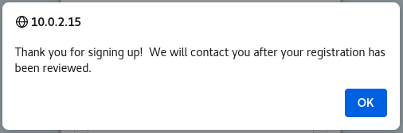
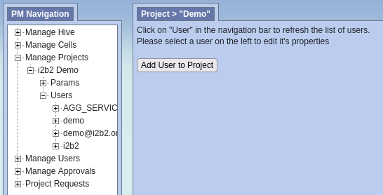

# i2b2 User Registration Guide

A guide on how to do the following:

- set the terms and conditions
- enable/disable user self-registration in i2b2 webclient
- self-register new user
- assign project and roles to new user (for administrator only)

Whenever a new user is added (registered) into the system, no project is assigned to the user.  Therefore, the new user cannot sign into the i2b2 application immediately after self registering.  The administrator has to the following first before the new user can sign in:

1. add the new user to a project
2. add the project roles to the new user

## Setting the Terms and Conditions

The ***terms and conditions***, also known as ***terms of service***, contain the rules created by the service provider in which the user of service must abide by.  The terms and conditions are located in the file ***i2b2_ui_config.js*** located in the directory **/var/www/html/webclient/js-i2b2/i2b2_ui_config.js**.  To set terms and conditions, modify the attribute ***termsCondition*** of the JSON object ***i2b2.UI.cfg*** in the ***i2b2_ui_config.js*** file.

An example of the terms and conditions:

```js
i2b2.UI = {};
/* Start Configuration. Note: be careful to keep trailing commas after each parameter */
i2b2.UI.cfg = {
   ...

   termsCondition: "Terms & Conditions\n\nLorem ipsum dolor sit amet, consectetur adipiscing elit. Ut nec volutpat lorem. 
   Donec augue lacus, vulputate nec arcu a, iaculis viverra felis. Integer sed suscipit risus. Donec ut mauris efficitur, 
   dignissim sapien eget, accumsan libero. Quisque pretium auctor feugiat. Duis eu vulputate odio, eu aliquam velit. 
   Integer sem leo, sagittis sit amet nibh a, auctor elementum ex. Pellentesque ut massa dapibus, sollicitudin turpis sed, 
   pharetra est. Cras sodales blandit lorem a finibus. Sed nibh mi, euismod ut libero et, hendrerit maximus enim. Cras 
   dignissim feugiat nunc, non fringilla sapien porttitor vel. Nullam lobortis sed sem sed laoreet. Praesent lorem leo, 
   efficitur id viverra in, luctus et lectus. Nunc eros risus, tempus ac iaculis eu, aliquam ac mauris. Donec id risus 
   nisi. Maecenas neque dui, porttitor non porttitor non, tincidunt nec ligula."

   ...
}

```

## Enabling or Disabling User Self-Registration

The i2b2 webclient has two ways to self-register, local self-registration and federation self-registration.

### Enabling Local User Self-Registration

Modify the file ***config.php*** that is located in the directory **/var/www/html/webclient/registration/user** to enable user self-registration.  Set the value of the PHP attribute **config_pm_uri** to ***'http://127.0.0.1/i2b2/services/PMService/getServices'***.

For an example:

```php
<?php

$config_service_account_id = 'i2b2';
$config_service_account_pw = 'demouser';

$config_pm_uri = 'http://127.0.0.1/i2b2/services/PMService/getServices';
$config_domain = 'i2b2demo';
$config_project_id = 'Demo';
```

Modify the file ***i2b2_config_data.json*** that is located in the directory **/var/www/html/webclient/** to enable option for user self-registration.  Set the value of the attribute **showRegistration** to ***true*** and set the value of the attribute **registrationMethod** empty.

For an example:

```json
{
    "domain": "i2b2demo",
    "name": "HarvardDemo",
    "allowAnalysis": true,
    "urlCellPM": "http:\/\/127.0.0.1\/i2b2\/services\/PMService\/",
    "registrationMethod": "",
    "loginType": "local",
    "showRegistration": true,
    "debug": true
}
```

Refresh the webpage and you should see the option to register user (circled in red):


### Enabling Federation User Self-Registration

Modify the file ***i2b2_config_data.json*** located in the directory **/var/www/html/webclient/**.  Set the value of the attribute **showRegistration** to ***true*** and set the value of the attribute **registrationMethod** to ***saml**.

For an example:

```json
{
    "domain": "i2b2demo",
    "name": "HarvardDemo",
    "allowAnalysis": true,
    "urlCellPM": "http:\/\/127.0.0.1\/i2b2\/services\/PMService\/",
    "registrationMethod": "saml",
    "loginType": "federated",
    "showRegistration": true,
    "debug": true
}
```

Refresh the webpage and you should see the option to register user (circled in red):


### Disabling User Self-Registration

To disable user self-registration for either local registration or federation registration, set the value of the attribute **showRegistration** to ***true*** in the file file ***i2b2_config_data.json*** located in the directory **/var/www/html/webclient/**.

##  Self-Registering New User

###  Local Self-Registering New User

Click on the "***Sign Up!***" link on the bottom of the **i2b2 Login** dialog.  A "**Sign Up**" modal will pop up containing a form for self-registering.  Fill out the user information on the left of the form.  Carefully read the terms-and-conditions, click on the checkbox "***I accept the Terms & Conditions***", and click on the button "***Sign Up***" to register on the right side of the form.

For an example:


Once registered, the sign-up modal will disappeared and a confirmation alert will pop up at the main (login) page:



###  Federation Self-Registering New User

Click on the "***Sign Up!***" link on the bottom of the **i2b2 Login** dialog.  A "**Sign Up**" modal will pop up containing a button to redirect you to your Identity Provider (IdP) for logging in:


Click the button to redirect to your IdP and sign in to your IdP:

For an example:


Once you are logged in, you will be redirected back to the i2b2 user registration page containing the terms-and-conditions.  Carefully read the terms-and-conditions, click on the checkbox "***I accept the Terms & Conditions***", and click on the button "***Sign Up***" to register.


Once registered, the page will redirected back to the main (login) page with a confirmation alert:


> Note that the new user cannot sign in immediately after self-registering.  An administrator has to add the new user to a project and add the project roles to the new user.  Below is the error shown if the new user attemp to log in immediately after registering:


##  Adding New User to a Project

1. Login using administrator account.

2. Choose ***Administrator*** project:

   

3. Under **Manage Users** section (on the left panel), you can see the new,self-registered user (Clark Kent):

   

4. Click on the **Manage Projects** section (on the left panel)

   

5. Click on the project you want to add the new user to.  In this example, we choose ***i2b2 Demo*** project:

   

6. Click on **Users** section under the project:

   

7. Click on ***Add User to Project*** button to add new user.  Type in the username of the new user and click on ***Add User to Project*** button.

   

##  Adding Project Roles to New User

1. Follow the steps 1-6 above.

2. Click on the user you want to add roles to.

   

3. Click on **Role** under user:

   

4. Select the roles to you to add to the user and click on the ***save*** button:

   
